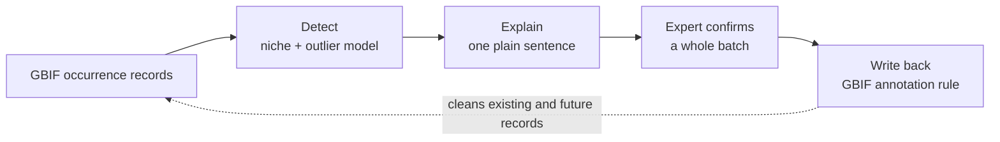
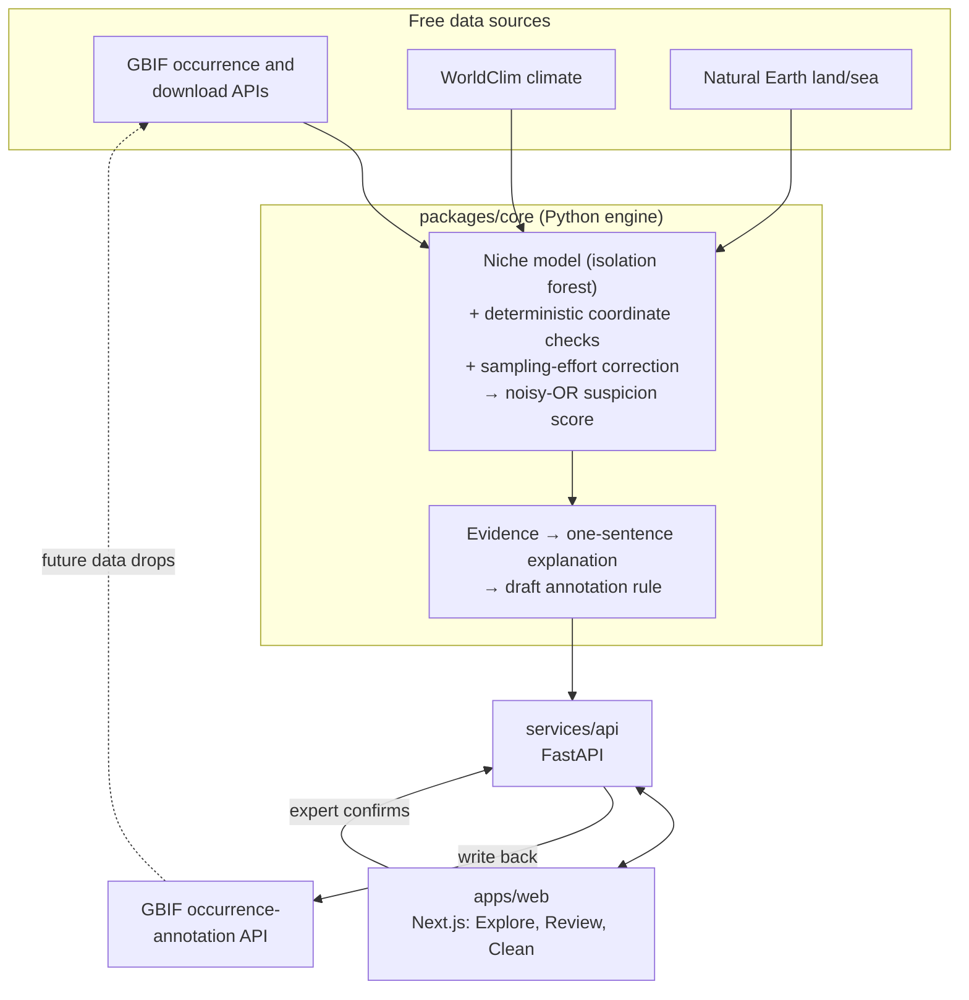

# TaxonGuard

**Find occurrence records in GBIF that cannot be right, explain why in one plain sentence, let an expert confirm, and write the correction back to GBIF so the data improves for everyone.**

[](https://github.com/this-is-rachit/taxonguard/actions/workflows/ci.yml)
[](LICENSE)

TaxonGuard is an entry in the 2026 GBIF Ebbe Nielsen Challenge. It is a data-quality
tool: it flags ecologically or taxonomically implausible occurrence records, explains
why each is suspect, lets a domain expert confirm or reject a whole batch, and
publishes the confirmed judgment to GBIF's occurrence-annotation system. A confirmed
rule cleans existing records and keeps catching matching records in future data drops.

It runs at no cost and with no key: free data only, a one-command local stack, and a
reproducible notebook that executes the whole loop offline.

---

## The problem TaxonGuard addresses

GBIF aggregates over three billion occurrence records from thousands of publishers.
Because anyone can contribute, it contains records that cannot be right. The standard
example is a frog recorded in the open ocean: a wrong coordinate or a misidentification.
Catching these by hand means an expert checking rows one at a time, which does not scale
to billions of records.

This is a problem GBIF has named, repeatedly, and recently:

- GBIF's **2026 Work Programme** lists adding the ability to annotate occurrence maps to
  flag suspicious records as planned work.
  ([2026 Work Programme](https://docs.gbif.org/2026-work-programme/en/))
- In **January 2026** GBIF shipped an experimental, rule-based occurrence-annotation tool
  and API, and stated that if the tool becomes popular the rules may be integrated into
  the main GBIF.org systems.
  ([Introducing Rule-based Annotations](https://data-blog.gbif.org/post/2026-01-21-rule-based-annotations/),
  [occurrence-annotation](https://github.com/gbif/occurrence-annotation))
- GBIF's own data blog notes there is no outlier detection built into GBIF, so it is left
  to each user to flag outliers themselves.
  ([Outlier detection using DBSCAN](https://data-blog.gbif.org/post/outlier-detection-using-dbscan/))
- The "frog in the ocean" annotation question has been open since GBIF's 2015 launch.

The infrastructure to receive corrections now exists but is new and nearly empty, and the
detection step that should feed it does not exist at GBIF. TaxonGuard is built to fill that
gap: an automated, explainable, expert-in-the-loop generator of annotation rules that plugs
directly into GBIF's newest infrastructure.

---

## What it does



1. **Learn** where each taxon plausibly occurs, from that taxon's own GBIF records.
2. **Detect** the implausible records and score every record for plausibility.
3. **Explain** each flag in one plain sentence a human can judge at a glance.
4. **Confirm** once: an expert resolves a whole batch of nearby records.
5. **Write back**: the confirmed rule is published to GBIF's annotation system, where it
   cleans existing records and keeps catching the same error in future data.

A confirmed rule is "records of this taxon inside this polygon are suspicious", which is
exactly the form GBIF's annotation system accepts (a taxon, a WKT polygon, and a controlled
value).

---

## Is it an AI wrapper? No

The component that decides whether a record is suspect is a niche and outlier model doing
measurable, testable mathematics, not a language model. A language model only writes the
explanation sentence, under a guard that rejects any sentence introducing a number not in
the computed evidence, and there is a deterministic fallback that runs with no key. Remove
the language model and the tool still works; you read the raw numbers instead of a sentence.
The framing is a data-quality engine with a thin, optional language layer for readability.

---

## How it works



The detection engine fuses several signals with a noisy-OR into one calibrated suspicion
score with a transparent per-signal reason breakdown:

- an **environmental outlier** score from an isolation forest fitted on each taxon's own
  climate envelope, so an exception (a saltwater frog) defines its own normal;
- **deterministic coordinate checks**: land/sea realm mismatch (the literal "frog in the
  ocean"), null-island, equal coordinates, whole-degree centroids, and institution
  coordinates;
- a **sampling-effort correction**, so sparsely surveyed regions are not treated as wrong;
- a **low-data confidence** ramp, so a sparsely recorded taxon leans on the deterministic
  checks rather than an unreliable niche model.

The full pipeline is `detect → explain → expert-confirm → write back`. Write-back goes
through a single adapter, so the experimental annotation API can change with a one-file fix,
and degrades to a copy-and-paste manual fallback when no GBIF credentials are configured.

### Three ways to use it

- **Explore**: search any species, score it on demand, filter by reason, score, or a drawn
  area, and propose a rule over the records you have filtered to.
- **Review**: work through grouped clusters of flagged records, confirm the real errors, and
  track what has been written back to GBIF.
- **Clean my data**: upload an occurrence file and check it with the same engine; the result
  stays with you and is never published to GBIF.

---

## How GBIF data is used

- Occurrence records are read through the GBIF occurrence search API for on-demand scoring,
  and through the GBIF **download API**, which mints a citable DOI, for the reproducible
  accuracy benchmark.
- Records are enriched with WorldClim climate variables and a Natural Earth land/sea flag.
- Confirmed rules are written back to GBIF's experimental occurrence-annotation API over the
  account's own credentials, so corrections re-enter the network rather than dying on a
  local download.

---

## Proof: how accurate is it

Detection is measured on a labeled benchmark where every error is known, so the two numbers
that matter can be counted directly: how many real errors are caught, and how many plausible
records are falsely flagged. The honest test plants known errors into a **real GBIF download**
and reports on a **held-out split** (the fusion weight is calibrated on one fold and every
metric reported on the untouched fold).

The demonstration set is *Rana temporaria* in Great Britain, **GBIF download DOI
[10.15468/dl.bpfzpj](https://doi.org/10.15468/dl.bpfzpj)**. On the held-out real data the
ROC-AUC is about 0.91, every deterministic error type reaches full recall, and climate is the
honest exception: real climate niches are multi-modal, so the mildest climate outliers sit
below the operating threshold by design rather than being hidden. The full method, the
trade-offs, and the figure are in [`docs/evaluation.md`](docs/evaluation.md), reproducible with
`uv run python -m taxonguard_core.eval.run --real`.

---

## Quick start

No account and no downloaded data are required to run or review TaxonGuard.

### The whole loop in one notebook (free, keyless)

```bash
uv sync
uv run jupyter notebook notebooks/taxonguard_demo.ipynb
```

The notebook runs detect → explain → draft rule → write back across several taxa. With no
data present it uses a labeled synthetic fallback so it runs offline; it uses real GBIF data
automatically once a cache is built. See [`notebooks/README.md`](notebooks/README.md).

### The full stack with one command (Docker)

```bash
docker compose -f infra/docker-compose.yml up --build
```

- Web app: http://localhost:3000
- API and interactive docs: http://localhost:8000/docs

### Local development

```bash
# Python engine and API
uv sync
uv run pytest
uv run uvicorn taxonguard_api.main:app --reload --app-dir services/api/src

# Web app
cd apps/web
npm install
npm run dev
```

Full operating instructions, including how to enable write-back with a free GBIF account, are
in [`docs/operating-instructions.md`](docs/operating-instructions.md).

---

## Repository layout

| Path | Contents |
|---|---|
| `packages/core` | Python detection engine: data pipeline, niche model, fusion, explanation, rule generation, GBIF annotation adapter, and the evaluation harness. Importable and tested on its own. |
| `services/api` | FastAPI service that wraps the core and exposes typed endpoints. |
| `apps/web` | Next.js, TypeScript, and Tailwind frontend (Explore, Review, Clean). |
| `notebooks/` | A reproducible, keyless notebook that runs the whole loop end to end. |
| `docs/` | Architecture, data schema, data sources and DOI, evaluation, and operating instructions. |
| `design/` | The frontend design system. |
| `infra/` | Dockerfiles and the single Docker Compose file. |

```
taxonguard/
├─ packages/core/      # detection engine (Python)
│  └─ src/taxonguard_core/{data,engine,explain,annotate,eval,clean}
├─ services/api/       # FastAPI service
├─ apps/web/           # Next.js front end
├─ notebooks/          # reproducible end-to-end demo
├─ docs/               # architecture, evaluation, data sources, operating instructions
├─ design/  infra/     # design system, containers
└─ pyproject.toml      # uv workspace
```

---

## How it answers the judging criteria

- **Openness and repeatability** — MIT licensed, public repository, free data and compute, a
  seeded deterministic pipeline, a one-command stack, and a notebook that reproduces the loop
  with no key.
- **Applicability** — taxon-agnostic and region-agnostic; useful to data users, publishers,
  and GBIF; three entry points (Explore, Review, Clean).
- **Novelty** — the first automated, explainable, expert-in-the-loop generator of GBIF
  annotation rules, turning a proven manual method into live infrastructure.
- **Quality** — typed, tested (180 Python tests; web unit and end-to-end tests; CI on every
  push), containerized, and honest about its limits, degrading gracefully on sparse data.

---

## Data sources and licenses

Occurrence data from GBIF (cite the download DOI), climate from WorldClim, and land/sea from
Natural Earth. Each source and its license is recorded in
[`docs/data-sources.md`](docs/data-sources.md). The map uses MapLibre GL with a free, keyless
demo style. The TaxonGuard name and the leaf-in-shield mark are original; this project is not
affiliated with or endorsed by GBIF.

## References

- GBIF Work Programme 2026 — https://docs.gbif.org/2026-work-programme/en/
- Introducing Rule-based Annotations (GBIF data blog, 2026) — https://data-blog.gbif.org/post/2026-01-21-rule-based-annotations/
- GBIF occurrence-annotation tool and API — https://github.com/gbif/occurrence-annotation
- Outlier detection using DBSCAN (GBIF data blog) — https://data-blog.gbif.org/post/outlier-detection-using-dbscan/
- Niche modeling flags implausible records (*From GenBank to GBIF*, 2016) — https://www.ncbi.nlm.nih.gov/pmc/articles/PMC4788202/

## License

MIT. See [LICENSE](LICENSE).
