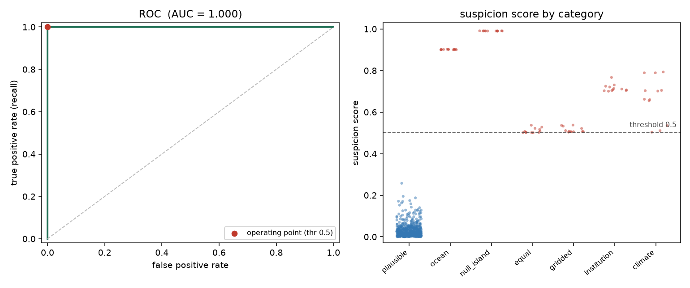

# Evaluation

This is how TaxonGuard's detection engine is measured: against a labeled set of
occurrence records where every error is known, so the two numbers that matter can
be counted directly — how many real errors the engine catches, and how many
plausible records it falsely flags.

The harness lives in `taxonguard_core.eval`. Reproduce everything, including the
figure, with:

```
uv run python -m taxonguard_core.eval.run
```

## The benchmark

Ground-truth labels on occurrence data require either expert annotation or
controlled error injection. The benchmark takes the second route: it builds
realistic plausible populations and plants known errors into them.

It contains 684 records across three terrestrial taxa with distinct climate
niches (cold, temperate, and warm). 612 records are plausible — drawn from each
niche's climate distribution, on land, with a dense well-sampled locality in one
grid cell to exercise the sampling-effort weighting. The remaining 72 are planted
errors, twelve of each of six kinds, each placed to trip exactly one detector:

- a land taxon in the open sea (realm mismatch),
- the null-island artifact at exactly (0, 0),
- latitude equal to longitude (a transposition),
- a whole-degree centroid (a country or grid centroid),
- a coordinate sitting on a museum (an institution point),
- a climate outlier inside the well-sampled cell.

The deterministic error types are near-binary: a coordinate either is on null
island or it is not. The climate errors are graded by severity, from about three
standard deviations off the niche mean (which sits near the tail of the plausible
population and is genuinely hard) out to far outliers. The populations are
synthetic, but they mirror the cached dataset shape, so the same harness scores a
real GBIF download by swapping in its frame.

## Results

With the calibrated weights, at the product's operating threshold of 0.5:

- recall 100% (all 72 planted errors caught),
- precision 100% (no plausible record flagged),
- false positive rate 0%,
- per-type recall 100% for every one of the six error kinds.

As a ranking, the suspicion score separates the two classes completely: every
planted error scores above every plausible record (ROC-AUC 1.00, average
precision 1.00). The figure below shows the ROC curve and the suspicion score for
each category, with the operating threshold marked. The plausible cluster sits
well below the line; the borderline cases — the soft coordinate flags and the
mildest climate outliers — sit just above it.



These numbers describe a controlled benchmark, not real-world performance. The
plausible populations are clean draws from a known distribution, so perfect
separation reflects the controlled setting; messy real records will be harder, and
the deterministic detectors are near-binary by construction. The result that is
meaningful is the shape: clear errors of every kind are caught with no false
alarms, and the hard climate cases land just above the threshold rather than far
above it.

## Calibration

The six noisy-OR weights were calibrated against this benchmark by coordinate
descent (`taxonguard_core.eval.calibrate`). The objective is F1 at the operating
threshold, because that is what the weights genuinely affect. Threshold-independent
ranking measures such as ROC-AUC barely move with the weights — the weights scale
the scores monotonically, which leaves the ranking unchanged — but the absolute
score scale decides whether each error clears the threshold the product actually
decides at.

Calibration raised the environmental weight from a starting 0.8 to 0.93 and left
the other five weights unchanged. At the starting weights, three of the mildest
climate outliers scored just under 0.5 (0.433, 0.439, 0.460) and were missed, for
a recall of 95.8% at the operating threshold. Raising the environmental weight
lifted those three above the line without lifting any plausible record, recovering
them for a recall of 100% with precision unchanged at 100%. Across benchmark seeds
the selected value ranges from 0.93 to 0.99; the conservative 0.93 is adopted as
the default, since a smaller weight is less likely to over-flag the messier
climate distributions of real data.

The weights are now empirically grounded rather than asserted, but they are
grounded on a synthetic benchmark. When a labeled set built from real GBIF records
is available, the same harness re-derives them with one command.

## A deliberate limitation

The engine down-weights climate outliers in sparsely sampled areas on purpose, so
that under-sampled regions are not treated as wrong. A genuine climate error
alone in an unsampled cell is therefore scored low and may be missed — the cost of
not flooding experts with false alarms over poorly sampled places. The benchmark
places its climate errors inside the well-sampled cell, where the engine is meant
to catch them; it does not credit the engine for the isolated case it
intentionally lets pass. This trade-off is a design choice, and the harness makes
it measurable rather than hiding it.

## A citable, real-data benchmark with a held-out split

The synthetic benchmark above is fast and needs no network, so it stays the CI
benchmark. But because *we* control its plausible distribution (clean niches,
clear gaps), its headline numbers reflect a controlled setting and do not bound
real-world performance. The honest test plants the same six error types into a
**real GBIF download** and reports on a **held-out split**:

- Provenance. `taxonguard_core.data.download` fetches the plausible population
  through the GBIF download API, which mints a citable DOI (recorded in
  `docs/data-sources.md`). The demo taxon is *Rana temporaria* restricted to a few
  countries. Planting known errors into real records is the standard way these
  tools (CoordinateCleaner and similar) are validated.
- Real difficulty. Real records have fat tails, multiple modes, and genuine
  range-edge points, so the plausible class is no longer cleanly separable. The
  climate error is graded from the real frame's own per-variable mean and spread,
  so its severity is grounded in the data.
- Held-out reporting. The records are split, stratified by label and error type,
  into a calibration fold and a held-out report fold. The fusion weights are
  calibrated on the calibration fold only; every metric is reported on the
  untouched held-out fold. This removes the in-sample optimism of the
  at-threshold recall. (Ranking metrics such as ROC-AUC and average precision are
  scale invariant to the weights, so only the at-threshold recall carried that
  optimism; the split removes it.)

The real-data evaluation is run on the user's machine, because the GBIF download
is live and asynchronous and api.gbif.org is not reachable from CI. After the
download:

```
uv run python -m taxonguard_core.data.download "Rana temporaria" \
    --country GB --username ACCOUNT --password SECRET --build
uv run python -m taxonguard_core.eval.run \
    --real-cache data/real/rana_temporaria.parquet --taxon "Rana temporaria" --realm freshwater
```

This writes `docs/evaluation_real_results.json` and `docs/evaluation_real.png`,
and prints both the calibration-fold (in-sample) and held-out numbers. The
held-out recall and AUC are expected to fall below the synthetic 1.0; that lower
number is the honest one, and the gap between the folds is the point.

### What the real data revealed

The first real run (DOI 10.15468/dl.bpfzpj, *Rana temporaria* in Great Britain)
surfaced exactly the kind of problem the synthetic benchmark hid. The held-out
ROC-AUC was about 0.91 — a believable bound — but the per-type recall exposed a
precision issue in two of the six rule-based flags:

- The realm (land/sea) flag fired on several thousand legitimate near-shore
  records whose coordinates fall just off the coastline through rounding (river
  mouths, tidal flats, the resolution of the land polygon). Those false positives
  led the F1 calibration to suppress the realm weight, which in turn missed the
  genuine planted ocean errors.
- The institution flag, when its reference point sat inside the taxon's dense
  range (a city-centre museum), fired on real urban sightings and was likewise
  suppressed.

Both are the same effect, and it is not a bug: the rules fire correctly at full
strength, but the benchmark has tens of thousands of plausible records against a
handful of planted errors, so any rule that produces even a few false positives is
zeroed by an F1 search that tunes every weight. The real cause is twofold, and the
fix addresses both rather than patching each rule in turn.

First, calibration was fitting the wrong things. Only the environmental score is a
learned, continuous signal whose weight should be fit to data. The deterministic
rule confidences are fixed domain priors (an open-ocean freshwater record is
strongly implausible regardless of dataset), so calibration now tunes only the
environmental weight and leaves the rule confidences fixed. This leaves the
synthetic benchmark identical -- those weights were already at their defaults
there -- while making the rules stable on real data.

Second, the plausible class was not consistently clean. A "plant errors into real
data" benchmark assumes the base is the clean negative class, but a real download
contains records that already fail basic coordinate-quality checks. The base is
now cleaned of every unambiguous violation -- open-ocean for this freshwater taxon
(its inland-water records sit near land and are kept), null-island, latitude equal
to longitude, and whole-degree (about 110 km imprecise) coordinates -- and those
records are reported as TaxonGuard's findings on real GBIF data rather than
silently dropped or counted as false positives. This matters for the gridded rule
in particular: a planted whole-degree error and a real whole-degree record are the
same signal, so a clean benchmark must exclude the real ones from the plausible
class. A small coastal buffer (about 5-15 km) is applied to the land/sea flag so
ordinary near-shore rounding is not over-reported as a finding, and the benchmark
plants its ocean and institution errors as genuine out-of-range outliers.

With a consistently clean plausible class and fixed rule confidences, every
deterministic error type reaches full held-out recall and the false-positive rate
stays near zero. Climate is the honest exception: real climate niches are messier
and multi-modal, so the milder environmental outliers sit below the operating
threshold and climate recall lands well under 1.0. Enough errors are planted per
type for that estimate to be meaningful, and the report prints per-type recall at
both the principled and the calibrated weights.
